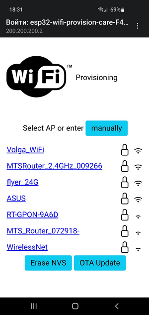

# esp32-wifi-provision-care

Just connects your ESP32 to Wi-Fi using credentials in default NVS partition.
If ESP32 has no saved credentials or ESP32 fails to connect Wi-Fi
esp32-wifi-provision-care spawns Wi-Fi Access Point with captive portal.

Wi-Fi provisioning page shows Wi-Fi routers near to ESP32.
Provisioning page allows upload new firmware "over the air".

   

How to use.

Append to your main/idf_component.yml file
```
  esp32-wifi-provision-care:
    git: https://github.com/uqfus/esp32-wifi-provision-care.git
```

Modify options in your sdkconfig.defaults in project 
```
CONFIG_LWIP_MAX_SOCKETS=16
CONFIG_HTTPD_MAX_REQ_HDR_LEN=1024
```
Append required ESP-IDF components to main/CMakeLists.txt
```
PRIV_REQUIRES esp_netif esp_wifi esp_http_server nvs_flash app_update
```

Append code to your project
```
#include "esp32-wifi-provision-care.h"
```

To void app_main(void) add
```
    wifi_provision_care(NULL); // connect to wifi. AP SSID would be "esp32-wifi-provision-care-XXXX"
```
or
```
    wifi_provision_care(""); // connect to wifi. AP SSID would be "esp32-wifi-provision-care-XXXX"
```
or
```
    wifi_provision_care("MyLovelyESP32"); // connect to wifi. AP SSID would be "MyLovelyESP32"
```